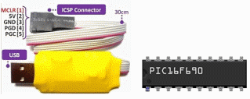

# Use Fritzing with PIC PK2 download and Cc5x C compiler

The Fritzing application is an Electronic Design Automation software, suited for the needs of makers and hobbyists.

When used to document microcontroller prototypes and to share them with others, both the hardware and the source code has to be shared - as it will often be needed to reproduce the hardware with some differences, and then this has to be accounted for in the code.

For many decades the PIC midrange family of microcontrollers has been popular with both industrial developers and hobbyists due to their low cost, wide availability, large user base, and extensive collection of application notes.

Most PIC type ever sold by Microchip is still available today!

Hobbyists has been using a varity of different tools when developing code for PIC-midrange processors. The code is then uploaded directly to the "PIC chip" with a "pic-programmer", and there exists many types of pic programmers.

## What's needed for PIC-midrange processors?

This **Fritzing-PK2-Cc5x** toolchain is ment to be used for sharing PIC midrange projects (perhaps as a "common denominator" for the many tool combinations that exists). This toolchain will be easy for everyone to setup, and it will not occupy much space on a hard drive (or on a USB stick). It could easily coexist with any other tool also used.

A PICKit2 clone "pic-programmer" will also be needed ( like the [icp01](http://www.piccircuit.com/shop/pic-programmer/25-icp01-usb-pic-programmer.html) ), but this does not need to be expensive. 

(A Windows user, could make extra use of this programmer in other electronic projects, as a USB-serial communication tool, or as a logic tool).

PIC midrange processors are often programmed directly in assembler code, due to architectural shortcomings of these processors (no longer the case with newer improved PIC architectures).

The [CC5X](http://www.bknd.com/) compiler (free edition) is a C compiler for PIC midrange processors that produce efficient code without the need of using assembly language (at the cost of not exact following the ANSII C standard). 

Allmost every existing PIC midrange project would be possible to express as Cc5x code.

The **paid versions** of the compiler will then be able to produce extremly efficient code for this older PICmicro architecture, if that's what's needed.

