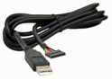

# Use Fritzing with PIC PK2 download and Cc5x C compiler

The Fritzing application is an Electronic Design Automation software, suited for the needs of makers and hobbyists.

When used to document microcontroller prototypes and to share them with others, both the hardware and the source code has to be shared - as it will often be needed to reproduce the hardware with some differences, and then this has to be accounted for in the code.

For many decades the PIC midrange family of microcontrollers has been popular with both industrial developers and hobbyists due to their low cost, wide availability, large user base, and extensive collection of application notes.

Most PIC type ever sold by Microchip is still available today!

Hobbyists has been using a varity of different tools when developing code for PIC-midrange processors. The code is then uploaded directly to the "PIC chip" with a "pic-programmer", and there exists many types of pic programmers.

## What's needed for PIC-midrange processors?


This **Fritzing-PK2-Cc5x** toolchain is ment to be used for sharing PIC midrange projects (perhaps as a "common denominator" for the many tool combinations that exists). This toolchain will be easy for everyone to setup, and it will not occupy much space on a hard drive (or on a USB stick). It could easily coexist with any other tool also used.

A PICKit2 clone "pic-programmer" will also be needed ( like the [icp01](http://www.piccircuit.com/shop/pic-programmer/25-icp01-usb-pic-programmer.html) ), but this does not need to be expensive. 

(A Windows user, could make extra use of this programmer in other electronic projects, as a USB-serial communication tool, or as a logic tool).

PIC midrange processors are often programmed directly in assembler code, due to architectural shortcomings of these processors (no longer the case with newer improved PIC architectures).

The [CC5X](http://www.bknd.com/) compiler (free edition) is a C compiler for PIC midrange processors that produce efficient code without the need of using assembly language (at the cost of not exact following the ANSII C standard). 

Allmost every existing PIC midrange project would be possible to express as Cc5x code.

The **paid versions** of the compiler will then be able to produce extremly efficient code for this older PICmicro architecture, if that's what's needed.


# Fritzing-PK2-Cc5x  Toolchain


## Toolchain environment


The toolchain for programming and downloading code to midrange PIC-processors consists of a C-compiler and a PK2-downloader. These programs must be downloaded from external sources.

A batfile `pk2cc5x.bat` will execute the programs `CC5X.EXE` and `pk2cmd.exe` in sequence.


## Cc5x Compiler


[Visit Cc5x homepage](http://www.bknd.com/cc5x/)

Download page [http://www.bknd.com/cc5x/downl-stud.shml](http://www.bknd.com/cc5x/downl-stud.shml)

Download  `cc5xfree.zip`  and unzip all (300) files to folder `Cc5x`.

(If you do this be sure that you agree with the
[terms of use](http://www.bknd.com/cc5x/downl-stud.shtml))

The executable file is `CC5X.EXE`.

## PK2Cmd folder


Download page [http://ww1.microchip.com/downloads/en/DeviceDoc/pk2cmdv1-20.zip](http://ww1.microchip.com/downloads/en/DeviceDoc/pk2cmdv1-20.zip)

Download `pk2cmdv1-20.zip` and unzip all (4) files to this folder. The executable file is `pk2cmd.exe`.

## Toolchain setup in Fritzing


In Fritzing you have to Browse to the toolchain folder. In **Edit** Menu choose **Preferences**. In **preferences** choose **Code View** tab and Browse to the location of the toolchain. Select the file  `pk2cc5x.bat`. Click on **OK**.

## Work folder optional


This folder is optional and can be used for your sourcefiles. Or you store them somewhere else.


## Sharing code with Fritzing

Example sketch with PIC 16F690 [pic_example.fzz](Work/pic_example.fzz)

The example C-code [hello_blink.c](Work/hello_blink.c)

When sharing code by exporting and importing sketches (`*.fzz` files) with other Fritzing users, the code found under the "code tab" will only be stored inside Fritzing. All previous bindings to a Platform/toolchain may have been lost.

### Save the imported Source Code to your Platform/Tool chain

Create an empty text file, in your preferred folder for source files, and copy the "content" from the Fritzing "code tab" to it. Use the same filename as found in the tab, and use the file extension `.c`.

Choose **Import Code ...** in the **Code** menu and browse to the created source file. Click on **Open**. The new "code tab" in the **Code View** window is now binded to your source file.

To avoid missunderstandings, you can now close the orginal tab. (Select the tab, and in the **Code** menu choose **Close Tab** and then check **Also delete the file**, as this orginal tab will not need to be used any moore). 


You will now be able to use **Upload** in the **Code View</B> with a PIC processor. 

### printf-debugging



If you have an **USB-to-Serial converter** you can use the Fritzing **Serial Monitor** to display texts and variable values from different locations in the program code with a `printf()` function. This will be a useful debugging tool.

(If you are a Windows user, you may prefer to use the **UART Tool** inside the **PICKit2 Windows program** directly without the need of an external serial converter). 

PICKit2 Windows program, Microchip Download [PICkit 2 V2.61 Install with .NET Framework](http://ww1.microchip.com/downloads/en/DeviceDoc/PICkit%202%20v2.61.00%20Setup%20dotNET%20A.zip) (30 Mb)

USB-to-Serial-5V converter, Page [FTDI TTL-232R-5V](http://www.ftdichip.com/Products/Cables/USBTTLSerial.htm)

## (Workaround if Fritzing lacks support for PK2CC5X toolchain)

Example sketch with PIC 16F690 wrapped as Arduino [pic_example_ino.fzz](Work/pic_example.fzz)

The example C-code wrapped as Arduino [hello_blink\hello_blink.ino](Work\hello_blink\hello_blink.ino)

 

If the Fritzing version does not support this PK2CC5X toolchain, as a workaround the C-code could be "wrapped" as Arduino code (Arduino is actually using C++ code, which C is a subset of). 

Change the **Platform Support** for Arduino by browsing to the BAT-file `picino.bat` in the toolchain folder. The PIC C-sourcefile now need to be stored as a `<name>.ino` file in a folder named `<name>` after the file. This is Arduino requirement is necessary.

The BAT-file `picino.bat` will copy the file and change the exstension to `*.c` and then run the tool chain. The Arduino selections (Platform and Board) will be ignored, and the PIC-processor type will be hardcoded to **PIC16F690** inside the BAT.file.

NOTE! This is just a workaround. The Arduino platform can not upload to PIC processors, and the PK2CC5X toolchain can not upload to Arduino boards.

Don't forget to change back the **Platform Support** to your "true" Arduino location, when Arduino is what you want to use.


## Usage on Linux

### Cc5x compiler
To run the Cc5x compiler you need wine. All major linux distributions
includes wine so install it using the package manager. On
ubuntu/debian:
```
sudo apt-get install wine
```

Now download and unpack the Cc5x compiler to the `Cc5x` directory as
described in the Windows instructions or from the command line issue
the following commands:

```
cd Cc5x
wget http://www.bknd.com/cc5xfree.zip
unzip cc5xfree.zip
```
(If you do this be sure that you agree with the
[terms of use](http://www.bknd.com/cc5x/downl-stud.shtml))

### PK2Cmd
To use with Linux download
[PK2Cmd for linux from Microchip](http://ww1.microchip.com/downloads/en/DeviceDoc/pk2cmdv1-20Linux2-6.tar.gz)
into the `PK2Cmd` folder and unpack it into it. On the command line
this equals:

```
cd PK2Cmd
wget http://ww1.microchip.com/downloads/en/DeviceDoc/pk2cmdv1-20Linux2-6.tar.gz
tar zxf pk2cmdv1-20Linux2-6.tar.gz
```

### Toolchain setup with Linux

In settings (see Windows instructions) use `pk2cc5x.sh` instead of `pk2cc5x.bat`.
